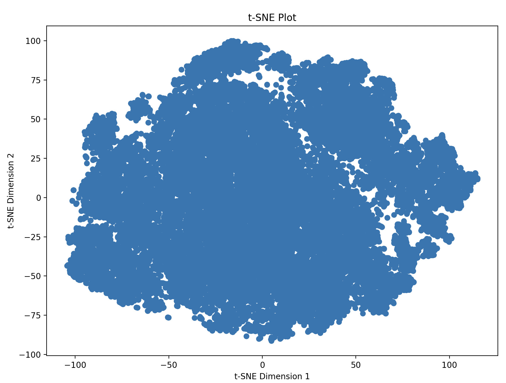
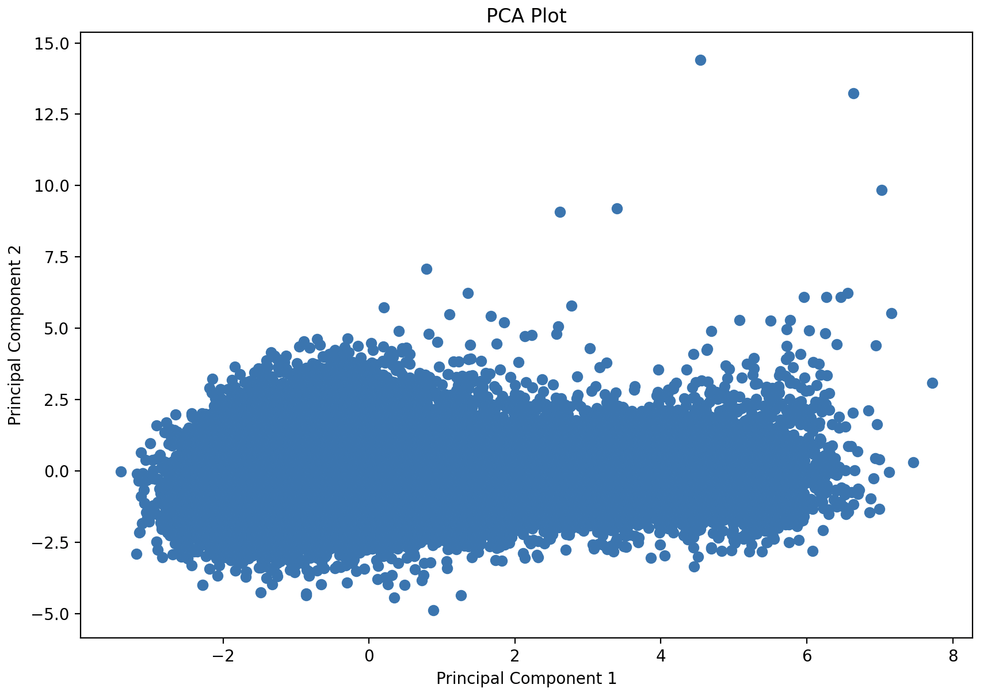
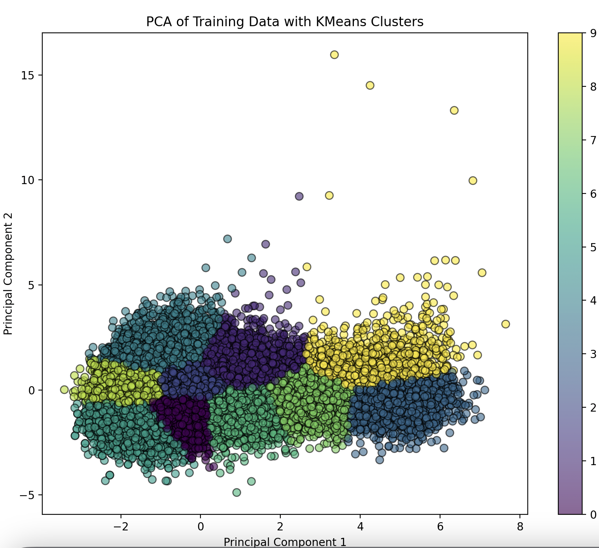
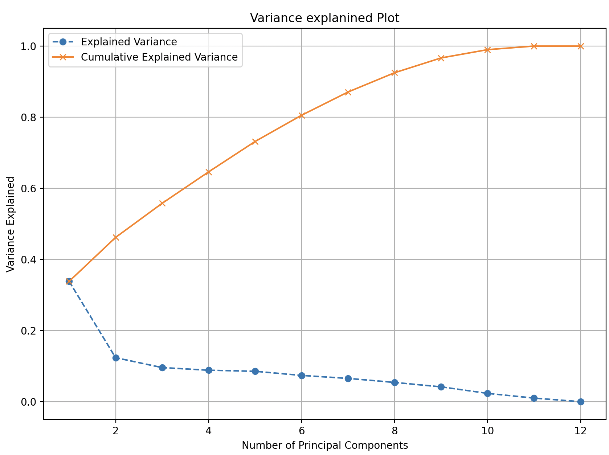
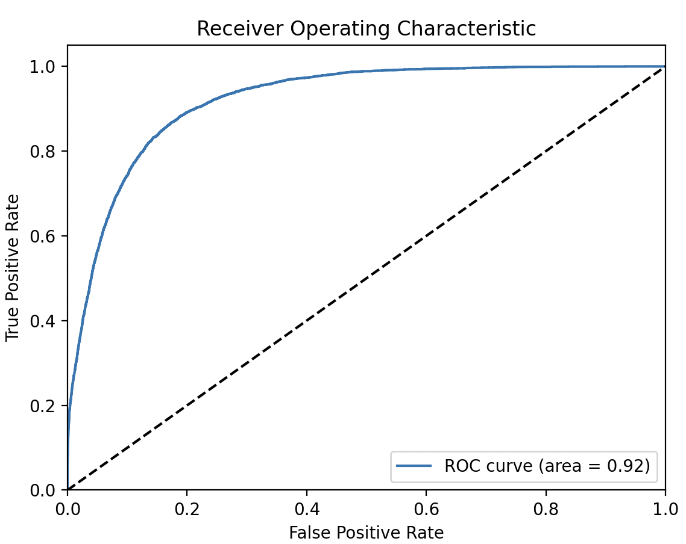

# Predicting Song Genre Using PCA and XGBoost

**Author**: Ivan Xiong

## Introduction

The goal of our classifier is to predict the genre of a song given certain characteristics about the song. We had the following predictors: `instance_id`, `artist_name`, `track_name`, `popularity`, `acousticness`, `danceability`, `duration_ms`, `energy`, `instrumentalness`, `liveness`, `loudness`, `speechiness`, `tempo`, `obtained_date`, and `valence`. The steps taken include data cleaning, training/testing set selection, dimensionality reduction, clustering, and using an XGBoost classifier.

## Data Cleaning

### Handling Missing Data

1. **`duration_ms`**:
   - Missing entries were initially replaced with `-1`.
   - The average duration of songs (excluding `-1` values) was computed and used to fill missing values.

2. **`tempo`**:
   - Missing entries were marked with a `?`.
   - Used domain knowledge to infer that `tempo` correlates with `acousticness`, `danceability`, `energy`, and `loudness`.
   - A linear regression model was used to predict and fill missing `tempo` values.

3. **Other Transformations**:
   - Changed `mode` from major/minor to `1/0`.
   - Transformed necessary columns from string to numerical data.

## Training/Testing Set Selection

To prevent leakage and ensure equal classification of all genres, the train-test split was done as follows:

1. **Testing Set**:
   - Randomly sampled 500 songs from each genre.

2. **Training Set**:
   - From the remaining dataset (excluding the testing set), randomly sampled 4500 songs from each genre.

## Dimensionality Reduction

### Normalization and Initial Reduction

- Normalized the data for PCA to prevent it from latching onto the largest magnitude scale.
- Initially performed a 2D reduction using t-SNE for visualization.

### Principal Component Analysis (PCA)

- Chose PCA over t-SNE for maintaining global structure and variance.
- PCA is computationally inexpensive and efficient for our dataset (~50,000 entries).

### Clustering

Using domain knowledge, we expected 10 clusters corresponding to the genres: `Electronic`, `Anime`, `Jazz`, `Alternative`, `Country`, `Rap`, `Blues`, `Rock`, `Classical`, and `Hip-Hop`. We used k-means clustering because the clusters were not expected to be of obscure shapes.

We aimed to account for 90% of the variance, which indicated using 9 principal components.

## Classification

Using an XGBoost classifier, we performed classification using all numerical predictors: `popularity`, `acousticness`, `danceability`, `duration_ms`, `energy`, `instrumentalness`, `liveness`, `loudness`, `speechiness`, `tempo`, and `valence` to predict `music_genre`.

### Model Building

- Ensured no overfitting, considering songs are highly varied.
- XGBoost was chosen for its regularization and iterative ensembles, preventing overfitting.
- Adjusted the learning rate hyper-parameter (0.1, 0.01, 0.001) and found the best performance at 0.1.

### Evaluation

- The model's AUROC was `0.9208755066666667`, indicating strong performance.
- Using only 2 principal components resulted in an AUROC of ~0.80, demonstrating the importance of selecting the optimal number of components.

The ROC curve confirms that our model significantly outperforms random guessing (AUROC = 0.5).

## Conclusion

The critical factor for the model's success was selecting the number of principal components. Using more principal components (up to 9) ensured capturing a significant portion of the variance and avoided underfitting.

